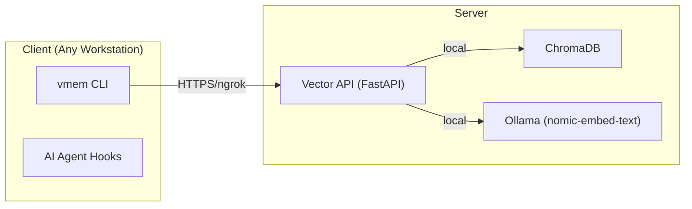

# 🧠 vmem: Universal Vector Memory System

vmem is a persistent vector memory layer for AI agents. It allows agents to save and retrieve context across sessions using ChromaDB and Ollama embeddings, ensuring long-term continuity in development and research.

---

## 🏗️ System Architecture

The system consists of a server-side vector database and a client-side CLI tool.



---

## 🚀 Server Setup

### 1. Prerequisites

- **Docker + Docker Compose**
- **Ollama**: Installed and running with the `nomic-embed-text` model.
- **ngrok**: Used to create a secure tunnel for the client.

### 2. Deployment

Clone the repository to your server and navigate to the vector-storage directory:

```bash
cd /path/to/vector-storage
```

### 3. Start the Services

Launch the API and Database using Docker Compose:

```bash
docker compose up -d
```

### 4. Create the Tunnel

Expose the FastAPI service (default port 8080) to the internet:

```bash
# Start ngrok tunnel
ngrok http 8080
```

> [!IMPORTANT]
> Keep the ngrok terminal open to maintain the connection. Copy the generated `https://...` URL for the client setup.

---

## 💻 Client Setup

### 1. Environment Variables

Configure your workstation to communicate with the server. Add these to your `.zshrc` or `.bashrc`:

```bash
export VECTOR_BASE_URL="https://your-ngrok-url.ngrok-free.dev"
export VECTOR_AUTH_TOKEN="your-secure-token"
```

### 2. SSH Configuration (Optional)

For easier deployment and log viewing, add the server to your `~/.ssh/config`:

```text
Host server-host
    HostName <YOUR_SERVER_IP>
    User <YOUR_REMOTE_USER>
```

### 3. CLI Installation

Install the `vmem` tool into your local bin directory:

```bash
cp vmem-cli/vmem.py ~/.bin/vmem
chmod +x ~/.bin/vmem
```

### 3. AI Agent Integration (Claude Code)

To enable Claude Code to use vector memory automatically, install the skills:

```bash
cp -r cc-skills/skills/* ~/.claude/skills/
```

---

## 🛠️ Usage Guide

### Core Commands

| Command             | Action                                     |
| :------------------ | :----------------------------------------- |
| `vmem init`         | Initialize vmem in the current project.    |
| `vmem save "text"`  | Save a technical insight or decision.      |
| `vmem query "term"` | Search memory for relevant past context.   |
| `vmem status`       | Check connection and current project mode. |

### Advanced Features

- **Compacts**: Save a "snapshot" of a major milestone using `vmem compact "description"`.
- **Global Search**: Use `vmem search "term"` to look across both project and global memory.
- **Maintenance**: Prune old data with `vmem prune --older-than 30`.

---

## 📝 Best Practices

1. **Be Concise**: When saving manually, use 2-4 sentences focused on the _why_ and _decisions_, not just _what_.
2. **Retrieve First**: Always start a new task by querying `vmem` for existing patterns or solutions.
3. **Toggle Modes**: Use `vmem toggle on` in projects where you want constant memory retention, and `off` for transient tasks.

---

> [!NOTE]  
> This system is designed to be portable to any Unix-like environment with Docker and Python support.
