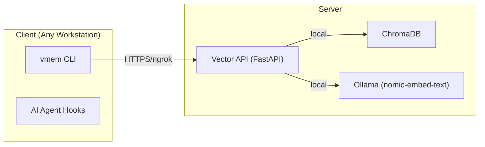

# 🧠 vmem: Universal Vector Memory System

vmem is a persistent vector memory layer for AI agents. It allows agents to save and retrieve context across sessions using ChromaDB and Ollama embeddings, ensuring long-term continuity in development and research.

---

## 🏗️ System Architecture

The system consists of a server-side vector database and a client-side CLI tool.



> **Hooks Documentation:** See [cc-hooks/README.md](cc-hooks/README.md) for details on automation scripts.

---

## 🚀 Server Setup

### 1. Prerequisites

- **Docker + Docker Compose**
- **Ollama**: Installed and running with the `nomic-embed-text` model.
- **ngrok**: Used to create a secure tunnel for the client.

### 2. Deployment

Clone the repository to your server and navigate to the vector-storage directory:

```bash
cd /path/to/vector-storage
```

> **Detailed Server Docs:** See [vector-storage/README.md](vector-storage/README.md) for advanced configuration.

### 3. Start the Services

Launch the API and Database using Docker Compose:

```bash
docker compose up -d
```

### 4. Create the Tunnel

Expose the FastAPI service (default port 8080) to the internet:

```bash
# Start ngrok tunnel
ngrok http 8080
```

> [!IMPORTANT]
> Keep the ngrok terminal open to maintain the connection. Copy the generated `https://...` URL for the client setup.

---

## 💻 Client Setup

### 1. Environment Variables

Configure your workstation to communicate with the server. Add these to your `.zshrc` or `.bashrc`:

```bash
export VECTOR_BASE_URL="https://your-ngrok-url.ngrok-free.dev"
export VECTOR_AUTH_TOKEN="your-secure-token"
```

### 2. SSH Configuration (Optional)

For easier deployment and log viewing, add the server to your `~/.ssh/config`:

```text
Host server-host
    HostName <YOUR_SERVER_IP>
    User <YOUR_REMOTE_USER>
```

### 3. CLI Installation

Install the `vmem` tool into your local bin directory:

```bash
cp vmem-cli/vmem.py ~/.bin/vmem
chmod +x ~/.bin/vmem
```

### 3. AI Agent Integration (Claude Code)

To enable Claude Code to use vector memory automatically, install the skills:

```bash
cp -r cc-skills/skills/* ~/.claude/skills/
```

> **Skill Documentation:** See [cc-skills/README.md](cc-skills/README.md).

---

## 🛠️ Usage Guide

### Project Initialization

| Command        | Purpose                     |
| -------------- | --------------------------- |
| `vmem init`    | Initialize vmem in project  |
| `vmem init on` | Init with auto-save + hooks |
| `vmem uninit`  | Complete project teardown   |

### Core Commands

| Command                      | Purpose                           |
| ---------------------------- | --------------------------------- |
| `vmem save "text"`           | Save to project (respects toggle) |
| `vmem save "text" --force`   | Force save (always works)         |
| `vmem save "text" --global`  | Save to global collection         |
| `vmem query "term"`          | Search project collection         |
| `vmem query "term" --global` | Search global collection          |
| `vmem search "term"`         | Search project + global           |

### Configuration

| Command              | Purpose                      |
| -------------------- | ---------------------------- |
| `vmem status`        | Check auto-save mode         |
| `vmem status --json` | Status as JSON (for scripts) |
| `vmem toggle on`     | Enable project auto-save     |
| `vmem toggle off`    | Disable project auto-save    |

### Maintenance

| Command                              | Purpose                           |
| ------------------------------------ | --------------------------------- |
| `vmem ping`                          | Check server connectivity         |
| `vmem history`                       | Show recent saves                 |
| `vmem history --global`              | Show global history               |
| `vmem prune --duplicates`            | Remove duplicate entries          |
| `vmem prune --older-than 30`         | Remove entries older than 30 days |
| `vmem prune compact --all`           | Remove all compacts               |
| `vmem prune compact --all --dry-run` | Preview compact removal           |
| `vmem prune compact --older-than`    | Remove old compacts               |
| `vmem prune --dry-run`               | Preview without deleting          |

### Compacts (Project Snapshots)

| Command                       | Purpose                    |
| ----------------------------- | -------------------------- |
| `vmem compact "text"`         | Save snapshot (max 5 kept) |
| `vmem retrieve compact`       | Get most recent compact    |
| `vmem retrieve compact 3`     | Get 3rd compact (1=newest) |
| `vmem retrieve compact --all` | List all compacts          |

---

## 📝 Best Practices

1. **Be Concise**: When saving manually, use 2-4 sentences focused on the _why_ and _decisions_, not just _what_.
2. **Retrieve First**: Always start a new task by querying `vmem` for existing patterns or solutions.
3. **Toggle Modes**: Use `vmem toggle on` in projects where you want constant memory retention, and `off` for transient tasks.

---

> [!NOTE]  
> This system is designed to be portable to any Unix-like environment with Docker and Python support.
